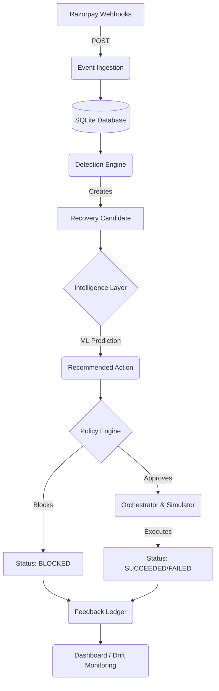

# System Architecture

The AI Revenue Recovery Agent is a deterministic, event-driven payment recovery orchestrator built for the Razorpay Buildathon.

## Core Components

1. **Event Ingestion Layer** (`FastAPI`): Ingests Razorpay-style webhooks (e.g. `payment.failed`, `subscription.halted`), normalizes them, and persists them into the local SQLite database.
2. **Detection Engine** (`detection.py`): Scans the data store for active failed payments and subscriptions. Calculates a deterministic priority score (based on amount, retry count, customer segment) and generates `RecoveryCandidate` records.
3. **Intelligence Layer** (`intelligence.py`): A custom local tabular ML engine (using `scikit-learn` Random Forest / Logistic Regression) that predicts `P(success | action)` for RETRY, PAYMENT_UPDATE, and ESCALATE. It then selects the action with the highest expected recovery value.
4. **Policy Engine** (`policy.py`): Enforces strict deterministic business rules. For example, it blocks retries on `suspected_fraud` and limits total retries to 3 per payment.
5. **Orchestrator** (`orchestrator.py`): Coordinates the flow from Candidate -> Intelligence -> Policy -> Execution. It maintains an idempotent state machine (`PENDING -> VALIDATING -> EXECUTING -> SUCCEEDED/FAILED/BLOCKED`).
6. **Simulator** (`simulator.py`): Simulates payment execution deterministically based on error codes and attempt numbers, eliminating the need for real payment credentials during the demo.
7. **Feedback Loop** (`metrics.py`, `drift.py`): Joins Candidates, Predictions, Actions, and Outcomes to calibrate model probabilities and detect performance drift over time.
8. **Dashboard** (`index.html`): A lightweight, read-only UI that polls the backend metrics APIs to visualize Revenue At Risk, Recovery Rate, Action Distribution, Calibration, and Recent Activity Explanations.

## Data Flow Diagram

