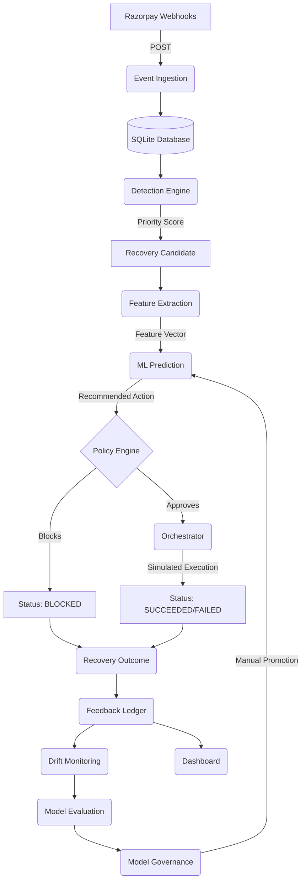

# System Architecture

The AI Revenue Recovery Agent is a deterministic, event-driven payment recovery orchestrator built for the Razorpay Buildathon.

## Core Components

1. **Event Ingestion Layer** (`webhooks.py`, `event_normalization.py`): Ingests Razorpay-style webhooks (e.g. `payment.failed`, `subscription.halted`), normalizes them, and persists them into the local SQLite database.
2. **Detection Engine** (`detection.py`): Scans the data store for active failed payments and halted subscriptions. Calculates a deterministic priority score (based on amount, retry count, customer segment) and generates `RecoveryCandidate` records.
3. **Feature Extraction** (`intelligence.py`): Extracts inference-time features from the candidate and related entities (customer segment, error code, retry count, payment method, time of day). Features **never** include outcome labels.
4. **Intelligence Layer** (`predictor.py`, `scoring.py`, `explainability.py`): A custom local tabular ML engine (using `scikit-learn` Random Forest) that predicts `P(success | action)` for RETRY, PAYMENT_UPDATE, and ESCALATE. Selects the action with the highest expected recovery value.
5. **Policy Engine** (`policy.py`): Enforces strict deterministic business rules. Blocks retries on `suspected_fraud`, `customer_dispute`, and `account_closed`. Limits total retries to 3 per payment.
6. **Recovery Orchestrator** (`orchestrator.py`): Coordinates the flow from Candidate → Intelligence → Policy → Execution. Maintains an idempotent state machine (`PENDING → VALIDATING → APPROVED → EXECUTING → SUCCEEDED/FAILED/BLOCKED`).
7. **Simulator** (`simulator.py`): Simulates payment execution deterministically based on error codes and attempt numbers. No real payment credentials or API calls.
8. **Feedback Loop** (`metrics.py`, `build_feedback_dataset.py`): Joins Candidates, Predictions, Actions, and Outcomes to produce a flat feedback ledger for calibration and evaluation.
9. **Drift Monitoring** (`drift.py`): Compares recent recovery performance against historical baselines. Raises `RETRAIN_RECOMMENDED` if absolute performance drops by >15%.
10. **Model Governance** (`registry.py`, `promote_model.py`): Manages model lifecycle (`VALIDATED → ACTIVE → RETIRED`). Only one model can be ACTIVE. Promotion is always explicit and manual.
11. **Dashboard** (`index.html`): A lightweight, read-only UI that polls the backend metrics APIs to visualize Revenue At Risk, Recovery Rate, Action Distribution, Calibration, and Recent Activity with ML Explanations.

## Data Flow Diagram

